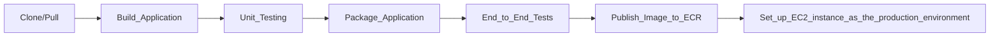

# 2-Tier EntryTracker Application

> A Python-based 2-tier application demonstrating modern DevOps practices with Docker, GitHub Actions, and AWS infrastructure.
## Table of Contents

- [Overview](#overview)
- [Architecture](#architecture)
- [Technology Stack](#technology-stack)
- [Prerequisites](#prerequisites)
- [Getting Started](#getting-started)
- [CI/CD Pipeline](#cicd-pipeline)

## Overview

This project demonstrates a complete CI/CD pipeline for a simple 2-tier Python application called EntryTracker, which integrates:

- Docker containerization
- AWS ECR and EC2 for cloud deployment
- GitHub Actions for CI/CD automation
- The pipeline includes application packaging, testing, publishing to AWS ECR, and deployment to an EC2 production instance.

## Key Features
- REST API-based application built with Python (Flask)
- 2-tier architecture using Docker Compose (App + MySQL)
- Containerization and image management via Docker & AWS ECR
- Automated CI/CD pipeline using GitHub Actions
- End-to-End (E2E) testing integrated into the CI workflow
- Continuous Deployment to AWS EC2 with Docker Compose
- Version-controlled Docker image tagging within CI pipeline

## Architecture

**2-Tier application architecture Diagram**

-----------------------------------

**AWS infrastructure architecture Diagram**

-----------------------------------
**Comprehensive diagram**

## Technology Stack

| Category             | Technologies   |
| -------------------- | -------------- |
| **Infrastructure**   | AWS EC2, AWS ECR |
| **Containerization** | Docker,Docker Compose |
| **CI/CD**            | GitHub Actions |
| **Version Control**  |    GitHub      |
| **Application**      | Python 3.10 (Flask)|
| **Database**         | MySQL 5.7 |

## Prerequisites

Requirements for building and running the project:

- AWS CLI configured
- Docker & Docker Compose installed
- Python 3.10 installed
- create manually - EC2 Instance (Amazon Linux 2 preferred)
- create manually - AWS ECR repository for Docker images

## CI/CD Pipeline

**PIPELINE DESCRIPTION**

